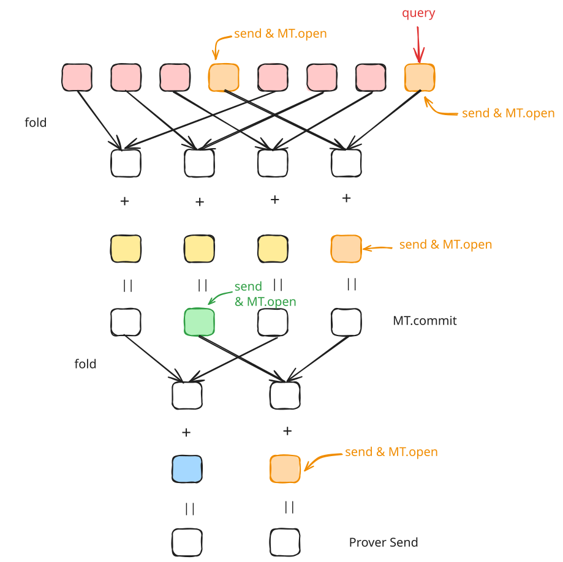
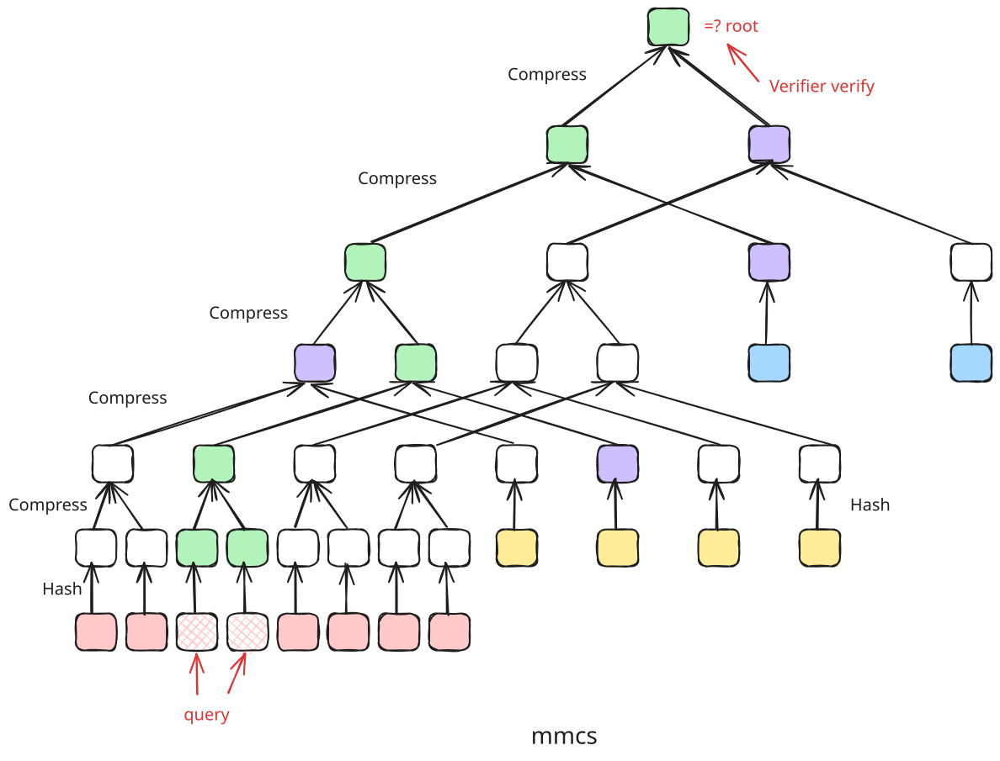
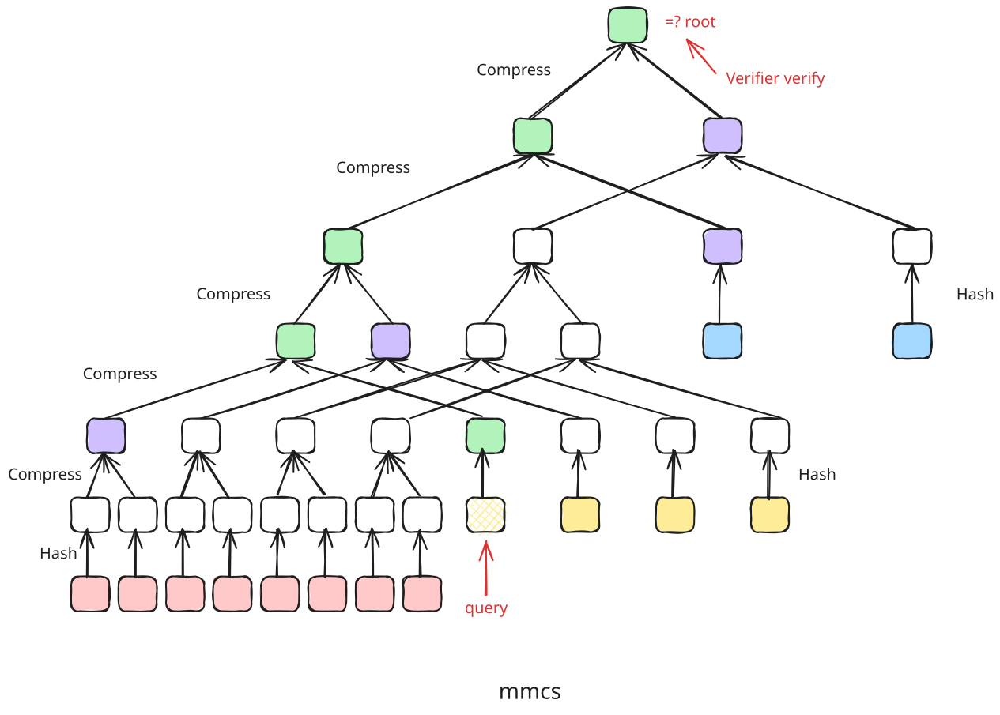
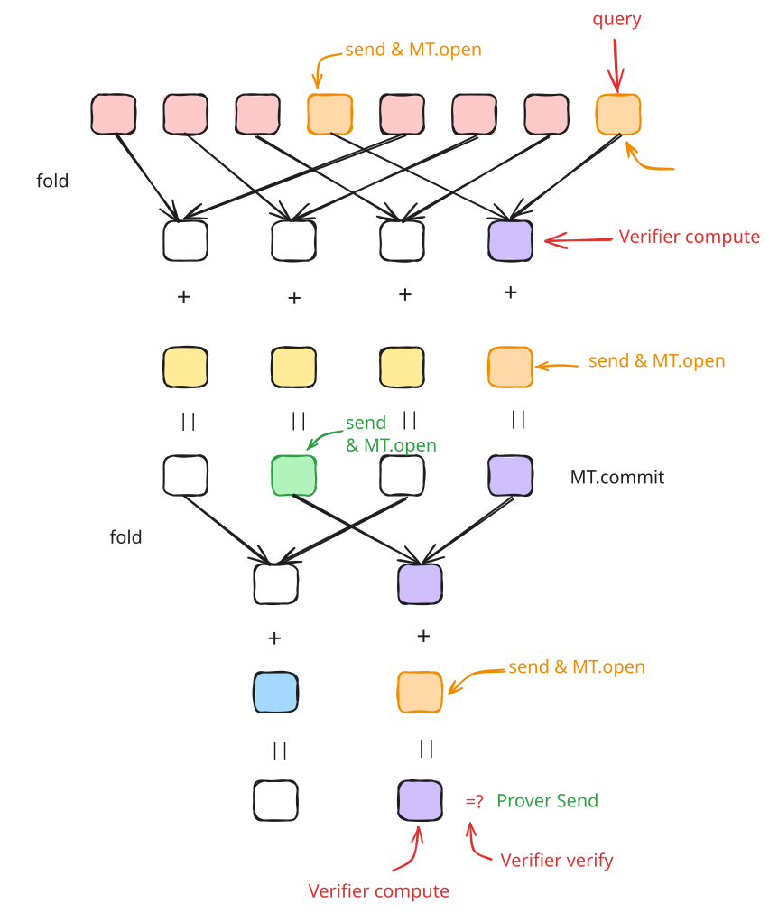

# zeromroph fri 协议复杂度分析

协议来源：[zeromorph-fri](https://github.com/sec-bit/mle-pcs/blob/main/zeromorph/zeromorph-fri.zh.md)

### Evaluation 证明协议

#### 公共输入

- MLE 多项式 $\tilde{f}$ 的承诺 $\mathsf{cm}([[\tilde{f}]]_n)$
- 求值点 $\mathbf{u}=(u_0, u_1, \ldots, u_{n-1})$
- 求值结果 $v = \tilde{f}(\mathbf{u})$
- 码率参数：$\rho$
- FRI 协议中进行 low degree test 查询阶段的重复查询的次数参数: $l$
- FRI 协议中编码的乘法子群：$D, D^{(0)}, \ldots, D^{(n - 1)}$ 

#### Witness

- MLE 多项式 $\tilde{f}$ 在 $n$ 维 HyperCube 上的点值向量 $\mathbf{a} = (a_0, a_1, \ldots, a_{2^n-1})$

#### Round 1

Prover 发送余数多项式的承诺

- 计算 $n$ 个余数 MLE 多项式， $\{\tilde{q}_k\}_{k=0}^{n-1}$ ，其满足

$$
\tilde{f}(X_0,X_1,\ldots, X_{n-1}) - v = \sum_{k=0}^{n-1} (X_k-u_k) \cdot \tilde{q}_k(X_0,X_1,\ldots, X_{k-1})
$$

- 构造余数 MLE 多项式所映射到的 Univariate 多项式 $\hat{q}_k=[[\tilde{q}_k]]_k, \quad 0 \leq k < n$
- 计算并发送它们的承诺，这里用 mmcs 结构对这 $n$ 个多项式的值放在同一棵树上进行承诺。先分别计算这些多项式在对应 $D^{(k)}$ 上的值，计算

$$
\{[\hat{q}_k(x)|_{x \in D^{(k)}}]\}_{k = 0}^{n - 1}
$$

其中 $|D^{(k)}| = 2^k / \rho$ ，再用 mmcs 对这 $(2^{n - 1} + 2^{n - 2} + \ldots + 2^0)/\rho$ 个值一次进行承诺，记为

$$
\mathsf{cm}(\hat{q}_{n - 1}, \hat{q}_{n - 2}, \ldots, \hat{q}_0) = \mathsf{MMCS.commit}(\hat{q}_{n - 1}, \hat{q}_{n - 2}, \ldots, \hat{q}_0)
$$

##### Prover Cost Round 1

-  直接用 [Zeromorph](https://eprint.iacr.org/2023/917) 论文 Appendix A.2 的算法能计算出 $q_k$ 在 Hypercube 上的值，即可以得到 $\hat{q}_k$ 的系数，根据论文的结论，整个算法复杂度为 $(2^{n+1} - 3) ~ \mathbb{F}_{\mathsf{add}}$ 以及 $(2^{n} - 2) ~ \mathbb{F}_{\mathsf{mul}}$ 。这里不计入加法的复杂度，因此计算出 $\hat{q}_k=[[\tilde{q}_k]]_k, \quad 0 \leq k < n$ 的复杂度为 $(N - 2) ~ \mathbb{F}_{\mathsf{mul}}$ 。
- 计算 $\{[\hat{q}_k(x)|_{x \in D^{(k)}}]\}_{k = 0}^{n - 1}$ ，由于已经计算得到 $\hat{q}_k(X)$ 的系数，现在直接代入 $D^{(k)}$ 进行求值计算。在一个点进行求值，使用 Horner 方法进行计算。

```python
@staticmethod
def evaluate_at_point(poly, point):
	"""Evaluate a polynomial at a single point using Horner's method."""
	result = 0
	for coeff in reversed(poly):
		result = result * point + coeff
	return result
```

例如求一个多项式在 $x$ 点处的值 $f(x) = a_0 + a_1 x + a_2 x^2 + a_3 x^3$ ，该算法的计算过程为

$$
\begin{aligned}
f(x) & = (a_3 \cdot x^2 + a_2 \cdot x + a_1) \cdot x + a_0 \\
& = ((a_3 \cdot x + a_2)\cdot x + a_1) \cdot x + a_0 \\
& = (((0 \cdot x + a_3) \cdot x + a_2)\cdot x + a_1) \cdot x + a_0
\end{aligned}
$$
先计算最里面括号内的，$(0 \cdot x + a_3)$ ，计算后的结果 `result` 再乘以 $x$ ，再加上对应的系数 $a_2$ ，以此类推得到计算结果。

对于一个有 $n$ 个系数的多项式，计算在一个点的值的复杂度为 $n ~ \mathbb{F}_{\mathsf{mul}}$ 。

$\hat{q}_k(X)$ 的系数有 $2^k$ 个，因此计算在一个点的值复杂度为 $2^k ~ \mathbb{F}_{\mathsf{mul}}$ ，而 $|D^{(k)}| = 2^k \cdot \mathcal{R}$ ，因此计算 $[\hat{q}_k(x)|_{x \in D^{(k)}}]$ 的复杂度为 $2^k \cdot 2^k \cdot \mathcal{R} ~ \mathbb{F}_{\mathsf{mul}}$ 。计算 $\{[\hat{q}_k(x)|_{x \in D^{(k)}}]\}_{k = 0}^{n - 1}$  的复杂度为

$$
\sum_{k = 0}^{n - 1} 2^k \cdot 2^k \cdot \mathcal{R} ~ \mathbb{F}_{\mathsf{mul}} = (2N - 2) \cdot \mathcal{R} ~ \mathbb{F}_{\mathsf{mul}}
$$

其中 $N = 2^n$ 。

- 计算承诺 $\mathsf{cm}(\hat{q}_{n - 1}, \hat{q}_{n - 2}, \ldots, \hat{q}_0) = \mathsf{MMCS.commit}(\hat{q}_{n - 1}, \hat{q}_{n - 2}, \ldots, \hat{q}_0)$ ，树的高度为 $2 \cdot \log (2^{n - 1} \cdot \mathcal{R})$ ，涉及到的 Hash 计算有 $(2^{n - 1} + \cdots + 2^0) \cdot \mathcal{R}$ 个，一次 Hash 操作的复杂度记为 $H$ 。涉及到的 Compress 操作为 $2^{n - 2} \cdot \mathcal{R} + \ldots + 2^{0} \cdot \mathcal{R} + 1$ ，记为 $(2^{n - 2} \cdot \mathcal{R} + \ldots + 2^{0} \cdot \mathcal{R} + 1) ~ C$ ，因此这一步的复杂度为
  
$$
\begin{aligned}
  & \mathsf{MMCS.commit}(2^{n-1} \cdot \mathcal{R}, \ldots, \mathcal{R})\\
  = & ((2^{n - 1} + \cdots + 2^0) \cdot \mathcal{R}) ~ H + (2^{n - 2} \cdot \mathcal{R} + \ldots + 2^{0} \cdot \mathcal{R} + 1) ~ C \\
  = & (N - 1) \cdot \mathcal{R} ~ H  + ((N/2 - 1) \cdot \mathcal{R} + 1) ~ C
\end{aligned}
$$

总结下这一轮的总复杂度为

$$
\begin{aligned}
  & (N - 2) ~ \mathbb{F}_{\mathsf{mul}} + (2N - 2) \cdot \mathcal{R} ~ \mathbb{F}_{\mathsf{mul}} + (N - 1) \cdot \mathcal{R} ~ H  + ((N/2 - 1) \cdot \mathcal{R} + 1) ~ C \\
  & = (2N \mathcal{R} + N - 2 \mathcal{R} - 2)  ~ \mathbb{F}_{\mathsf{mul}} + (N \mathcal{R} - \mathcal{R})  ~ H  + (\frac{N \mathcal{R}}{2} - \mathcal{R} + 1) ~ C \\
 & = (2N \mathcal{R} + N - 2 \mathcal{R} - 2)  ~ \mathbb{F}_{\mathsf{mul}} + \mathsf{MMCS.commit}(2^{n-1} \cdot \mathcal{R}, \ldots, \mathcal{R})
\end{aligned}
$$

#### Round 2

1. Verifier 发送随机数 $\zeta \stackrel{\$}{\leftarrow} \mathbb{F} \setminus D$ 
2. Prover 计算并发送 $\hat{f}(\zeta)$ 
3. Prover 计算 

$$
q_{f_\zeta}(X) = \frac{\hat{f}(X) - \hat{f}(\zeta)}{X - \zeta}
$$

在 $D$ 上的值，即

$$
[q_{f_\zeta}(x)|_{x \in D}] = \big[\frac{\hat{f}(x) - \hat{f}(\zeta)}{ x - \zeta} \big|_{x \in D} \big]
$$
4. Prover 计算并发送 $\{\hat{q}_k(\zeta)\}_{k = 0}^{n - 1}$ 。
5. Prover 计算

$$
q_{\hat{q}_k}(X) = \frac{\hat{q_k}(X) - \hat{q}_k(\zeta)}{X - \zeta}, \, 0 \le k < n
$$

在 $D^{(k)}$ 上的值，即

$$
[q_{\hat{q}_k}(x)|_{x \in D^{(k)}}] = \big[\frac{\hat{q}_k(x) - \hat{q}_k(\zeta)}{ x - \zeta} \big|_{x \in D^{(k)}} \big]
$$

##### Prover Cost Round 2

- 计算 $\hat{f}(\zeta)$ ，Prover 有 $\hat{f}$ 的系数式，现在是求在一点的值，复杂度为 $N ~ \mathbb{F}_{\mathsf{mul}}$ 。
- 计算 $[q_{f_\zeta}(x)|_{x \in D}]$ 。
  - 先计算 $q_{f_\zeta}(X)$ 多项式，使用线性除法，分子中的多项式 $\deg(\hat{f}(X)) =2^n - 1 = N - 1$ ，因此线性除法复杂度为 $(N - 1) ~ \mathbb{F}_{\mathsf{mul}}$ 。
  - 由于 $|D| = N \cdot \mathcal{R}$ ，$q_{f_\zeta}(x)$ 的系数有 $N - 1$ 个，使用 Horner 方法求值，计算 $[q_{f_\zeta}(x)|_{x \in D}]$ 复杂度为 $N\mathcal{R} \cdot (N - 1)~ \mathbb{F}_{\mathsf{mul}}$ 。
  - 这一步的总复杂度为 $(N^2 \mathcal{R} - N \mathcal{R} + N - 1) ~ \mathbb{F}_{\mathsf{mul}}$ 。
- 计算 $\{\hat{q}_k(\zeta)\}_{k = 0}^{n - 1}$ ，复杂度为

  $$
    \sum_{k = 0}^{n - 1} 2^k ~ \mathbb{F}_{\mathsf{mul}} = (N - 1) ~ \mathbb{F}_{\mathsf{mul}}
  $$

- 计算 $q_{\hat{q}_k}(X)$ ，使用线性除法，分子中的多项式 $\deg(\hat{q_k}(X)) =2^k - 1$ ，因此线性除法复杂度为 $(2^k - 1) ~ \mathbb{F}_{\mathsf{mul}}$ 。遍历所有的 $k$ ，复杂度为 $(N - n - 1) ~ \mathbb{F}_{\mathsf{mul}}$ 。
- 计算 $[q_{\hat{q}_k}(x)|_{x \in D^{(k)}}]$ ，由于 $|D_k| = 2^k \cdot \mathcal{R}$ ，$q_{\hat{q_k}}(X)$ 的系数有 $2^k - 1$ 个，因此其复杂度为 $(2^k - 1) \cdot 2^k \cdot \mathcal{R} ~ \mathbb{F}_{\mathsf{mul}}$ 。对于 $k = 0, \ldots, n - 1$ ，计算所有的 $[q_{\hat{q}_k}(x)|_{x \in D^{(k)}}]$ 的复杂度为

$$
\sum_{k = 0}^{n - 1} (2^k - 1) \cdot 2^k \cdot \mathcal{R} ~ \mathbb{F}_{\mathsf{mul}} = (\frac{1}{3}N^2 \cdot \mathcal{R} - N \cdot \mathcal{R}+ \frac{2}{3} \cdot \mathcal{R}) ~ \mathbb{F}_{\mathsf{mul}}
$$

整理汇总 Round 2 的计算复杂度为

$$
\begin{aligned}
  & {\color{blue} N ~ \mathbb{F}_{\mathsf{mul}}} + {\color{red} (N^2 \mathcal{R} - N \mathcal{R} + N - 1) ~ \mathbb{F}_{\mathsf{mul}}} + {\color{blue}{(N - 1) ~ \mathbb{F}_{\mathsf{mul}}}} + \color{red}{(N - n - 1) ~ \mathbb{F}_{\mathsf{mul}}} \\
  & + \color{blue}{(\frac{1}{3}N^2 \cdot \mathcal{R} - N \cdot \mathcal{R}+ \frac{2}{3} \cdot \mathcal{R}) ~ \mathbb{F}_{\mathsf{mul}}} \\
  = & (\frac{4}{3} \mathcal{R} N^2 + (4 - 2\mathcal{R}) N - n + \frac{2}{3} \mathcal{R} - 3)  ~ \mathbb{F}_{\mathsf{mul}}
\end{aligned}
$$


#### Round 3

Prover 与 Verifier 进行 FRI 协议的 low degree test 交互，证明 $q_{f_\zeta}(X)$ 的次数小于 $2^{n}$ ，

$$
\pi_{q_{f_\zeta}} \leftarrow \mathsf{FRI.LDT}(q_{f_\zeta}(X), 2^n)
$$

- 记 $q_{f_\zeta}^{(0)}(x)|_{x \in D} := q_{f_\zeta}(x)|_{x \in D}$
- 对于 $i = 1,\ldots, n$ ，
  - Verifier 发送随机数 $\alpha^{(i)}$
  - 对于任意的 $y \in D_i$ ，在 $D_{i - 1}$ 中找到 $x$ 满足 $y^2 = x$，Prover 计算

  $$
    q_{f_\zeta}^{(i)}(y) = \frac{q_{f_\zeta}^{(i - 1)}(x) + q_{f_\zeta}^{(i - 1)}(-x)}{2} + \alpha^{(i)} \cdot \frac{q_{f_\zeta}^{(i - 1)}(x) + q_{f_\zeta}^{(i - 1)}(-x)}{2x}
  $$

  
  - 如果 $i < n$ ，Prover 发送 $[q_{f_\zeta}^{(i)}(x)|_{x \in D_{i}}]$ 的 Merkle Tree 承诺，
  
  $$
  \mathsf{cm}(q_{f_\zeta}^{(i)}(X)) = \mathsf{MT.commit}([q_{f_\zeta}^{(i)}(x)|_{x \in D_{i}}])
  $$

  - 如果 $i = n$ ，任选 $x_0 \in D_{n}$ ，Prover 发送 $q_{f_\zeta}^{(i)}(x_0)$ 的值。

> 📝 **Notes**
>
> 如果折叠次数 $r < n$ ，那么最后不会折叠到常数多项式，因此 Prover 在第 $r$ 轮时会发送一个 Merkle Tree 承诺，而不是发送一个值。

##### Prover Cost Round 3

- 对于 $i = 1，\ldots, n$
  - Prover 计算

  $$
    q_{f_\zeta}^{(i)}(y) = \frac{q_{f_\zeta}^{(i - 1)}(x) + q_{f_\zeta}^{(i - 1)}(-x)}{2} + \alpha^{(i)} \cdot \frac{q_{f_\zeta}^{(i - 1)}(x) + q_{f_\zeta}^{(i - 1)}(-x)}{2x}
  $$

  计算方式还可以改为

  $$
    q_{f_\zeta}^{(i)}(y) = (\frac{1}{2} + \frac{\alpha^{(i)}}{2x}) \cdot q_{f_\zeta}^{(i - 1)}(x) + (\frac{1}{2} - \frac{\alpha^{(i)}}{2x}) \cdot q_{f_\zeta}^{(i - 1)}(-x)
  $$

  plonky3 中采用了 [fold_even_odd.rs](https://github.com/Plonky3/Plonky3/blob/main/fri/src/fold_even_odd.rs) 下面这种计算方式。

```rust
#[instrument(skip_all, level = "debug")]
pub fn fold_even_odd<F: TwoAdicField>(poly: Vec<F>, beta: F) -> Vec<F> {
    // We use the fact that
    //     p_e(x^2) = (p(x) + p(-x)) / 2
    //     p_o(x^2) = (p(x) - p(-x)) / (2 x)
    // that is,
    //     p_e(g^(2i)) = (p(g^i) + p(g^(n/2 + i))) / 2
    //     p_o(g^(2i)) = (p(g^i) - p(g^(n/2 + i))) / (2 g^i)
    // so
    //     result(g^(2i)) = p_e(g^(2i)) + beta p_o(g^(2i))
    //                    = (1/2 + beta/2 g_inv^i) p(g^i)
    //                    + (1/2 - beta/2 g_inv^i) p(g^(n/2 + i))
    let m = RowMajorMatrix::new(poly, 2);
    let g_inv = F::two_adic_generator(log2_strict_usize(m.height()) + 1).inverse();
    let one_half = F::TWO.inverse();
    let half_beta = beta * one_half;

    // TODO: vectorize this (after we have packed extension fields)

    // beta/2 times successive powers of g_inv
    let mut powers = g_inv
        .shifted_powers(half_beta)
        .take(m.height())
        .collect_vec();
    reverse_slice_index_bits(&mut powers);

    m.par_rows()
        .zip(powers)
        .map(|(mut row, power)| {
            let (r0, r1) = row.next_tuple().unwrap();
            (one_half + power) * r0 + (one_half - power) * r1
        })
        .collect()
}
```

  可以先计算出 $2^{-1}$ 复杂度为 $\mathbb{F}_{\mathsf{inv}}$ 。
  
  在第 $i$ 轮，计算 $\frac{\alpha^{(i)}}{2} = \alpha^{(i)} \cdot 2^{-1}$ ，复杂度为 $\mathbb{F}_{\mathsf{mul}}$ 。

  对于每一个 $y \in D_i$ ，计算 $q_{f_\zeta}^{(i)}(y)$ ，计算 $x^{-1}$ ，再相乘，复杂度为 $\mathbb{F}_{\mathsf{inv}} + 3 ~\mathbb{F}_{\mathsf{mul}}$ ，而 $|D_i| = 2^{n - i} \cdot \mathcal{R}$ ，这一步的复杂度为 $2^{n - i} \cdot \mathcal{R} ~\mathbb{F}_{\mathsf{inv}} + 3 \cdot 2^{n - i} \cdot \mathcal{R} ~\mathbb{F}_{\mathsf{mul}}$ 。

  对于每一个 $i$ ，计算的总复杂度为

  $$
    (2^{n - i} \cdot \mathcal{R}) ~\mathbb{F}_{\mathsf{inv}} + (3 \cdot 2^{n - i} \cdot \mathcal{R}+ 1) ~\mathbb{F}_{\mathsf{mul}}
  $$

  因此总复杂度为

  $$
  \mathbb{F}_{\mathsf{inv}} + \sum_{i = 1}^{n}((2^{n - i} \cdot \mathcal{R}) ~\mathbb{F}_{\mathsf{inv}} + (3 \cdot 2^{n - i} \cdot \mathcal{R}+ 1) ~\mathbb{F}_{\mathsf{mul}}) = (\mathcal{R}N - \mathcal{R} + 1) ~\mathbb{F}_{\mathsf{inv}} +  (3\mathcal{R}N + n - 3\mathcal{R}) ~\mathbb{F}_{\mathsf{mul}}
  $$

  - 如果 $i < n$ ，Prover 发送 $[q_{f_\zeta}^{(i)}(x)|_{x \in D_{i}}]$ 的 Merkle Tree 承诺，这里主要是涉及 Hash 操作，树的高度为 $\log (2^{n - i} \cdot \mathcal{R})= n - i + \log(\mathcal{R})$ 。如果树的叶子节点有 $2^k$ 个，那么需要进行的哈希操作有 $2^{k - 1} + 2^{k - 2} + \ldots + 2 + 1 = 2^k - 1$ 次。即 $\mathsf{MT.commit}(2^{n-i} \cdot \mathcal{R}) = (2^{n-i} \cdot \mathcal{R} - 1) ~ H$ 。

总结上述所有的计算，对于折叠，总共要折叠 $n$ 次，复杂度为 $(\mathcal{R}N - \mathcal{R} + 1) ~\mathbb{F}_{\mathsf{inv}} +  (3\mathcal{R}N + n - 3\mathcal{R}) ~\mathbb{F}_{\mathsf{mul}}$ 。对于 Merkle Tree 承诺，复杂度为

$$
\sum_{i = 1}^{n - 1}\mathsf{MT.commit}(2^{n-i} \cdot \mathcal{R}) = \sum_{i = 1}^{n - 1}\mathsf{MT.commit}(2^{i} \cdot \mathcal{R})
$$

因此这一轮的总复杂度为

$$
\begin{aligned}
  & (\mathcal{R}N - \mathcal{R} + 1) ~\mathbb{F}_{\mathsf{inv}} +  (3\mathcal{R}N + n - 3\mathcal{R}) ~\mathbb{F}_{\mathsf{mul}}+ \sum_{i = 1}^{n - 1}\mathsf{MT.commit}(2^{i} \cdot \mathcal{R}) \\
\end{aligned}
$$

一般地，要证明一个多项式的次数小于 $2^n$ ，在 FRI low degree test 阶段的复杂度如上所示。

#### Round 4

这一轮是接着 Prover 与 Verifier 进行 FRI 协议的 low degree test 交互的查询阶段，Verifier 重复查询 $l$ 次：
- Verifier 从 $D_0$ 中随机选取一个数 $s^{(0)} \stackrel{\$}{\leftarrow} D_0$ 
- Prover 发送 $\hat{f}(s^{(0)}), \hat{f}(- s^{(0)})$ 的值，并附上 Merkle Path。
  
  $$
  \{(\hat{f}(s^{(0)}), \pi_{\hat{f}}(s^{(0)}))\} \leftarrow \mathsf{MT.open}([\hat{f}(x)|_{x \in D_0}], s^{(0)})
  $$

  $$
  \{(\hat{f}(-s^{(0)}), \pi_{\hat{f}}(-s^{(0)}))\} \leftarrow \mathsf{MT.open}([\hat{f}(x)|_{x \in D_0}], -s^{(0)})
  $$
- Prover 计算 $s^{(1)} = (s^{(0)})^2$ 
- 对于 $i = 1, \ldots, n - 1$
  - Prover 发送 $q_{f_\zeta}^{(i)}(s^{(i)}), q_{f_\zeta}^{(i)}(-s^{(i)})$ 的值，并附上 Merkle Path。
  
  $$
  \{(q_{f_\zeta}^{(i)}(s^{(i)}), \pi_{q_{f_\zeta}^{(i)}}(s^{(i)}))\} \leftarrow \mathsf{MT.open}([q_{f_\zeta}^{(i)}(x)|_{x \in D_i}], s^{(i)})
  $$

  $$
  \{(q_{f_\zeta}^{(i)}(-s^{(i)}), \pi_{q_{f_\zeta}}^{(i)}(-s^{(i)}))\} \leftarrow \mathsf{MT.open}([q_{f_\zeta}^{(i)}(x)|_{x \in D_i}], -s^{(i)})
  $$
  - Prover 计算 $s^{(i + 1)} = (s^{(i)})^2$

> 如果折叠次数 $r < n$ ，那么最后一步就要发送 $q_{f_\zeta}^{(r)}(s^{(r)})$ 的值，并附上 Merkle Path。

##### Prover Cost Round 4

在查询阶段，Prover 的计算复杂度主要来自计算 $s^{(i + 1)} = (s^{(i)})^2$ ，但这些数都是来自 $D_i$ 中的元素，不需要再额外计算，可以通过索引值得到。

#### Round 5

Prover 与 Verifier 进行 FRI 协议的 low degree test 交互，这里使用 rolling batch 技巧进行优化，对于 $k = 0, \ldots, n - 1$ ， 一次证明所有 $q_{\hat{q}_k}(X)$ 的次数小于 $2^k$ ，记为

$$
\pi_{q_{\hat{q}_{n - 1}}, \ldots, q_{\hat{q}_{0}}} \leftarrow \mathsf{OPFRI.LDT}(q_{\hat{q}_{n - 1}}, \ldots, q_{\hat{q}_{0}}, 2^{n - 1})
$$

具体过程如下：

1. 初始化 $i = n - 1$ ，对于 $x \in D^{(n - 1)}$ ，初始化

$$
\mathsf{fold}^{(i)}(x) = q_{\hat{q}_{n - 1}}(x)
$$
2. 当 $i = n - 2, \ldots, 0$ 时：

- Verifier 发送随机数 $\beta^{(i)}$

- 对于 $y \in D^{(i)}$ ，在 $D^{(i + 1)}$ 中找到 $x$ 满足 $y = x^2$ ，Prover 计算

$$
\mathsf{fold}^{(i)}(y) = \frac{\mathsf{fold}^{(i + 1)}(x) + \mathsf{fold}^{(i + 1)}(-x)}{2} + \beta^{(i)} \cdot \frac{\mathsf{fold}^{(i + 1)}(x) + \mathsf{fold}^{(i + 1)}(-x)}{2x}
$$

-  对于 $x \in D^{(i)}$ ，Prover 更新 $\mathsf{fold}^{(i)}(x)$

$$
\mathsf{fold}^{(i)}(x) = \mathsf{fold}^{(i)}(x) + q_{\hat{q}_{i}}(x)
$$

- 当 $i > 0$ 时，
  - Prover 发送 $\mathsf{fold}^{(i)}(x)$ 的承诺，即

    $$
    \mathsf{cm}(\mathsf{fold}^{(i)}(X)) = \mathsf{MT.commit}([\mathsf{fold}^{(i)}(x)|_{x \in D^{(i)}}])
    $$
- 当 $i = 0$ 时，由于最后折叠到常数多项式，Prover 选取 $D^{(0)}$ 中的任意一个点 $y_0 \in D^{(0)}$，发送折叠到最后的值 $\mathsf{fold}^{(0)}(y_0)$ 。

##### Prover Cost Round 5

这里虽然折叠中增加了一步，要计算 

$$
\mathsf{fold}^{(i)}(x) = \mathsf{fold}^{(i)}(x) + q_{\hat{q}_{i}}(x)
$$

但是这里并没有涉及有限域的乘法操作，其余计算复杂度与 Round 3 类似，这里直接将 Prover Cost Round 3 中的 $n$ 变为 $n - 1$ ，即为这一轮的复杂度

$$
\begin{aligned}
& (\mathcal{R}N - \mathcal{R} + 1) ~\mathbb{F}_{\mathsf{inv}} +  (3\mathcal{R}N + (n - 1) - 3\mathcal{R}) ~\mathbb{F}_{\mathsf{mul}}+ \sum_{i = 1}^{n - 2}\mathsf{MT.commit}(2^{i} \cdot \mathcal{R}) \\
= & (\mathcal{R}N - \mathcal{R} + 1) ~\mathbb{F}_{\mathsf{inv}} +  (3\mathcal{R}N + n - 3\mathcal{R} - 1) ~\mathbb{F}_{\mathsf{mul}} + + \sum_{i = 1}^{n - 2}\mathsf{MT.commit}(2^{i} \cdot \mathcal{R})
\end{aligned}
$$

#### Round 6

这一轮是接着 Prover 与 Verifier 进行 FRI 协议的 low degree test 交互的查询阶段，Verifier 重复查询 $l$ 次 ：
- Verifier 从 $D^{(n - 1)}$ 中随机选取一个数 $t^{(n - 1)} \in D^{(n - 1)}$
- Prover 发送 $\hat{q}_{n-1}(t^{(n - 1)})$ 与 $\hat{q}_{n-1}(-t^{(n - 1)})$ 以及其 Merkle Path 

$$
\{(\hat{q}_{n-1}(t^{(n - 1)}), \pi_{\hat{q}_{n-1}}(t^{(n - 1)})\} \leftarrow \mathsf{MMCS.open}(\hat{q}_{n - 1}, t^{(n - 1)})
$$

$$
\{(\hat{q}_{n-1}(-t^{(n - 1)}), \pi_{\hat{q}_{n-1}}(-t^{(n - 1)})\} \leftarrow \mathsf{MMCS.open}(\hat{q}_{n - 1}, -t^{(n - 1)})
$$

- 对于 $i = n - 2, \ldots, 1$，
  - Prover 计算 $t^{(i)} = (t^{(i + 1)})^2$
  - Prover 发送 $\hat{q}_{i}(t^{(i)})$ 及其 Merkle Path
      $$
      \{(\hat{q}_{i}(t^{(i)}), \pi_{\hat{q}_{i}}(t^{(i)})\} \leftarrow \mathsf{MMCS.open}(\hat{q}_{i}, t^{(i)})
      $$

  - Prover 发送 $\mathsf{fold}^{(i)}(-t^{(i)})$ 及其 Merkle Path
      $$
      \{(\mathsf{fold}^{(i)}(-t^{(i)}), \pi_{\mathsf{fold}^{(i)}}(-t^{(i)})\} \leftarrow \mathsf{MT.open}(\mathsf{fold}^{(i)}, -t^{(i)})
      $$ 
- 对于 $i = 0$ 时，
  - Prover 计算 $t^{(0)} = (t^{(1)})^2$
  - Prover 发送 $\hat{q}_0(s^{(0)})$ 及其 Merkle Path
      $$
      \{(\hat{q}_0(t^{(0)}), \pi_{\hat{q}_0}(t^{(0)})\} \leftarrow \mathsf{MMCS.open}(\hat{q}_0, t^{(0)})
      $$

> 📝 **Notes**
>
> 例如对 3 个多项式进行 query，query 选取的是 $q_{\hat{q}_2}(X)$ 中的最后一个元素 $\omega_2^7$，那么 Prover 需要发送的值及其 Merkle Path 是下图中绿色部分，橙色边框标记的发送的并非商多项式本身的值和对应的 Merkle Path，而是 $\hat{q}_k(X)$ 的 Merkle Path，即 Prover 会发送
>
> $$
> \{\hat{q_2}(\omega_2^7), \hat{q_2}(\omega_2^3), \hat{q}_1(\omega_1^3), \mathsf{fold}^{(1)}(\omega_1^1),  \hat{q}_0(\omega_0^1)\}
> $$
>
> 以及这些值对应的 Merkle Path。
> 
> 

##### Prover Cost Round 6

在查询阶段，不涉及 Prover 额外的计算。

#### Prover Cost

汇总 Prover Cost，

$$
\begin{aligned}
  & \color{red}{(2N \mathcal{R} + N - 2 \mathcal{R} - 2)  ~ \mathbb{F}_{\mathsf{mul}} + \mathsf{MMCS.commit}(2^{n-1} \cdot \mathcal{R}, \ldots, \mathcal{R})} \\
  & + \color{blue}{(\frac{4}{3} \mathcal{R} N^2 + (4 - 2\mathcal{R}) N - n + \frac{2}{3} \mathcal{R} - 3)  ~ \mathbb{F}_{\mathsf{mul}}} \\
  & + \color{red}{(\mathcal{R}N - \mathcal{R} + 1) ~\mathbb{F}_{\mathsf{inv}} + (3\mathcal{R}N + n - 3\mathcal{R}) ~\mathbb{F}_{\mathsf{mul}} + \sum_{i = 1}^{n - 1}\mathsf{MT.commit}(2^{i} \cdot \mathcal{R})} \\
  & + \color{blue}{(\mathcal{R}N - \mathcal{R} + 1) ~\mathbb{F}_{\mathsf{inv}} +  (3\mathcal{R}N + n - 3\mathcal{R} - 1) ~\mathbb{F}_{\mathsf{mul}} + \sum_{i = 1}^{n - 2}\mathsf{MT.commit}(2^{i} \cdot \mathcal{R})} \\
  = & (\frac{4}{3}\mathcal{R} N^2 + (6 \mathcal{R} + 5) N + n - \frac{22}{3} \mathcal{R} - 6)  ~ \mathbb{F}_{\mathsf{mul}} + (2\mathcal{R}N - 2\mathcal{R} + 2) ~ \mathbb{F}_{\mathsf{inv}} \\
  & + \mathsf{MMCS.commit}(2^{n-1} \cdot \mathcal{R}, \ldots, \mathcal{R}) + \sum_{i = 1}^{n - 1}\mathsf{MT.commit}(2^{i} \cdot \mathcal{R}) + \\
  & + \sum_{i = 1}^{n - 2}\mathsf{MT.commit}(2^{i} \cdot \mathcal{R}) 
\end{aligned}
$$

#### Proof

Prover 发送的证明为

$$
\begin{aligned}
  \pi = \left(\mathsf{cm}(\hat{q}_{n - 1}, \hat{q}_{n - 2}, \ldots, \hat{q}_0), \hat{f}(\zeta), \hat{q}_0(\zeta), \ldots, \hat{q}_{n - 1}(\zeta), \pi_{q_{f_\zeta}}, \pi_{q_{\hat{q}_{n - 1}}, \ldots, q_{\hat{q}_{0}}}\right)
\end{aligned}
$$

用符号 $\{\cdot\}^l$ 表示在 FRI low degree test 的查询阶段重复查询 $l$ 次产生的证明，由于每次查询是随机选取的，因此花括号中的证明也是随机的。那么 FRI 进行 low degree test 的两个证明为

$$
\begin{aligned}
  \pi_{q_{f_\zeta}} = &  ( \mathsf{cm}(q_{f_\zeta}^{(1)}(X)), \ldots, \mathsf{cm}(q_{f_\zeta}^{(n - 1)}(X)),q_{f_\zeta}^{(n)}(x_0),  \\
  & \, \{\hat{f}(s^{(0)}), \pi_{\hat{f}}(s^{(0)}), \hat{f}(- s^{(0)}), \pi_{\hat{f}}(-s^{(0)}), \\
  & \quad q_{f_\zeta}^{(1)}(s^{(1)}), \pi_{q_{f_\zeta}^{(1)}}(s^{(1)}),q_{f_\zeta}^{(1)}(-s^{(1)}), \pi_{q_{f_\zeta}^{(1)}}(-s^{(1)}), \ldots, \\
  & \quad q_{f_\zeta}^{(n - 1)}(s^{(n - 1)}), \pi_{q_{f_\zeta}^{(n - 1)}}(s^{(n - 1)}),q_{f_\zeta}^{(n - 1)}(-s^{(n - 1)}), \pi_{q_{f_\zeta}^{(i)}}(-s^{(n - 1)})\}^l)
\end{aligned}
$$

$$
\begin{aligned}
  \pi_{q_{\hat{q}_{n - 1}}, \ldots, q_{\hat{q}_{0}}} = &  ( \mathsf{cm}(\mathsf{fold}^{(n - 2)}(X)), \ldots, \mathsf{cm}(\mathsf{fold}^{(1)}(X)),\mathsf{fold}^{(0)}(y_0),  \\
  & \, \{\hat{q}_{n - 1}(t^{(n - 1)}), \pi_{\hat{q}_{n-1}}(t^{(n - 1)}), \hat{q}_{n - 1}(- t^{(n - 1)}), \pi_{\hat{q}_{n-1}}(- t^{(n - 1)}),\\
  & \quad \hat{q}_{n - 2}(t^{(n - 2)}), \pi_{\hat{q}_{n - 2}}(t^{(n - 2)}), \mathsf{fold}^{(n - 2)}(-t^{(n - 2)}), \pi_{\mathsf{fold}^{(n - 2)}}(-t^{(n - 2)}), \ldots, \\
  & \quad \hat{q}_{1}(t^{(1)}), \pi_{\hat{q}_{1}}(t^{(1)}), \mathsf{fold}^{(1)}(-t^{(1)}), \pi_{\mathsf{fold}^{(1)}}(-t^{(1)}), \hat{q}_0(t^{(0)}), \pi_{\hat{q}_0}(t^{(0)})\}^l)
\end{aligned}
$$

##### Proof Size

1. $\mathsf{cm}(\hat{q}_{n - 1}, \hat{q}_{n - 2}, \ldots, \hat{q}_0)$ ，这里承诺是用 mmcs 结构进行承诺的，发送的是一个 Hash 值，记为 $H$ 。
2. $\hat{f}(\zeta), \hat{q}_0(\zeta), \ldots, \hat{q}_{n - 1}(\zeta)$ ，都是有限域中的值，大小为 $(n + 1) ~ \mathbb{F}$ 。

计算 $\pi_{q_{f_\zeta}}$ 的大小，

- $\mathsf{cm}(q_{f_\zeta}^{(1)}(X)), \ldots, \mathsf{cm}(q_{f_\zeta}^{(n - 1)}(X)),q_{f_\zeta}^{(n)}(x_0)$ 大小为 $n ~ H + \mathbb{F}$ 。
- $\hat{f}(s^{(0)}), \pi_{\hat{f}}(s^{(0)}), \hat{f}(- s^{(0)}), \pi_{\hat{f}}(-s^{(0)})$ ，其中 $\pi_{\hat{f}}(s^{(0)})$ 与 $\pi_{\hat{f}}(-s^{(0)})$ 都是 Merkle Path，这里 $\hat{f}$ 是用 Merkle Tree 结构进行承诺的，该树的叶子节点有 $2^n \cdot \mathcal{R}$ 个，因此对于 $\pi_{\hat{f}}(s^{(0)})$ 与 $\pi_{\hat{f}}(-s^{(0)})$ ，一个 Merkle Path 有 $\log (2^n \cdot \mathcal{R}) = n + \log \mathcal{R}$ 个哈希值，总共要发送 $(2n + 2 \log \mathcal{R}) ~ H$ ，若将叶子节点 $\hat{f}(s^{(0)})$ 与 $\hat{f}(- s^{(0)})$ 放在相邻的位置，它们放在一起进行哈希，这样 Merkle Path 还能简化，只需要发送 $n + \log \mathcal{R} - 1$ 个哈希值。因此这一步发送的证明大小为 $2 ~ \mathbb{F} + (n + \log \mathcal{R} - 1) ~ H$ 。
- 对于 $i = 1, \ldots, n - 1$ ，发送 $q_{f_\zeta}^{(i)}(s^{(i)}), \pi_{q_{f_\zeta}^{(i)}}(s^{(i)}),q_{f_\zeta}^{(i)}(-s^{(i)}), \pi_{q_{f_\zeta}^{(i)}}(-s^{(i)})$ ，Merkle Tree 的叶子节点的个数为 $2^{n - i} \cdot \mathcal{R}$ ，因此对于每一轮 $i$ ，其大小为 $2 ~ \mathbb{F} + (n - i + \log \mathcal{R} - 1) ~ H$ 。总复杂度为

$$
\begin{aligned}
  \sum_{i = 1}^{n - 1} (2 ~ \mathbb{F} +(n - i + \log \mathcal{R} - 1) ~ H) = (2n - 2) ~ \mathbb{F} + (\frac{1}{2}n^2 + (\log \mathcal{R} - \frac{3}{2})n - \log \mathcal{R} + 1) ~ H
\end{aligned}
$$
  
因此 $\pi_{q_{f_\zeta}}$ 的大小为

$$
\begin{aligned}
  & n ~ H + \mathbb{F} + 2l ~ \mathbb{F} + (n + \log \mathcal{R} - 1)\cdot l ~ H + (2n - 2) \cdot l ~ \mathbb{F} + (\frac{1}{2}n^2 + (\log \mathcal{R} - \frac{3}{2})n - \log \mathcal{R} + 1) \cdot l ~ H \\
= & (2 l n + 1) ~ \mathbb{F} + (\frac{l}{2} \cdot n^2 + (\log R \cdot l - \frac{l}{2}) \cdot n ) ~H
\end{aligned}
$$

计算 $\pi_{q_{\hat{q}_{n - 1}}, \ldots, q_{\hat{q}_{0}}}$ 的大小，

- $\mathsf{cm}(\mathsf{fold}^{(n - 2)}(X)), \ldots, \mathsf{cm}(\mathsf{fold}^{(1)}(X)),\mathsf{fold}^{(0)}(y_0)$ 的大小为 $(n - 1) ~ H + \mathbb{F}$ 。
- $\hat{q}_{n - 1}(t^{(n - 1)}), \pi_{\hat{q}_{n-1}}(t^{(n - 1)}), \hat{q}_{n - 1}(- t^{(n - 1)}), \pi_{\hat{q}_{n-1}}(- t^{(n - 1)})$ ，$\hat{q}_{n - 1}$ 是放在 mmcs 结构中的，若将 $\hat{q}_{n - 1}(t^{(n - 1)})$ 和 $\hat{q}_{n - 1}(- t^{(n - 1)})$ 安排为 mmcs 结构中相邻的两个叶子节点，且将它们会压缩成一个哈希值，那么树的高度为 $2(n - 1 + \log \mathcal{R})$ ，由于两个叶子节点相邻，因此发送的哈希值为 $2(n - 1 + \log \mathcal{R}) - 2 = 2n + 2 \log \mathcal{R} - 4$ 个。总共大小为 $2 ~ \mathbb{F} + (2n + 2 \log \mathcal{R} - 4) ~ H$ 。

如下图所示，绿色部分 Verifier 打开时可以自己计算哈希值，紫色部分是 Prover 发送的哈希值。



- 对于 $i = 1, \ldots, n - 2$ ，发送 $\hat{q}_{i}(t^{(i)}), \pi_{\hat{q}_{i}}(t^{(i)}), \mathsf{fold}^{(i)}(-t^{(i)}), \pi_{\mathsf{fold}^{(i)}}(-t^{(i)})$ 。

对于 $\hat{q}_{i}(t^{(i)}), \pi_{\hat{q}_{i}}(t^{(i)})$ ，这里需要发送 mmcs 结构中的 merkle path 。



例如要打开 $\hat{q}_{1}(\omega_1^0)$ ，那么图中紫色的哈希值是 Prover 发送的证明。在 Verifier 进行验证阶段，其可以计算出图中绿色部分的值，最后比较树中最上端的绿色方块的值是否和 Prover 之前承诺时发送的根节点值相等。

$\hat{q}_{i}(t^{(i)})$ 所对应的 $\hat{q}_i(X)$ 承诺时有 $2^i \cdot \mathcal{R}$ 个值。那么 $\pi_{\hat{q}_{i}}(t^{(i)})$ 要发送的哈希值有 $2 (\log(2^{i} \cdot \mathcal{R})) =2i + 2 \log \mathcal{R}$ 个。

$\mathsf{fold}^{(i)}(x)$ 所在的 Merkle Tree 的树的高度为 $i + \log \mathcal{R}$ 。对于 $\mathsf{fold}^{(i)}(-t^{(i)}), \pi_{\mathsf{fold}^{(i)}}(-t^{(i)})$ ，用的是 Merkle 树承诺，树的高度为 $i + \log \mathcal{R}$ ，那么发送的哈希值有 $i + \log \mathcal{R}$ 个。

因此对于每一轮 $i$ ，其大小为 $2 ~ \mathbb{F} +(3i + 3\log \mathcal{R}) ~ H$ 。总复杂度为

$$
\begin{aligned}
  & \sum_{i = 1}^{n - 2} (2 ~ \mathbb{F} +(3i + 3\log \mathcal{R}) ~ H) \\
  = & (2n - 4) ~ \mathbb{F} + (\frac{3(n - 2)(n - 1)}{2} + 3(n - 2) \log \mathcal{R}) ~ H \\
  = & (2n - 4) ~ \mathbb{F} + (\frac{3}{2} n^2 + (3\log \mathcal{R} - \frac{9}{2}) n + 3 - 6 \log \mathcal{R})  ~ H
\end{aligned}
$$
  
因此 $\pi_{q_{\hat{q}_{n - 1}}, \ldots, q_{\hat{q}_{0}}}$ 的大小为

$$
\begin{aligned}
  & (n - 1) ~ H + \mathbb{F} + 2l ~ \mathbb{F} + (2n + 2 \log \mathcal{R} - 4)l ~ H + (2n - 4)l ~ \mathbb{F} + (\frac{3}{2} n^2 + (3\log \mathcal{R} - \frac{9}{2}) n + 3 - 6 \log \mathcal{R})l ~ H \\
  = & (2ln - 2l + 1) ~ \mathbb{F} + \left(\frac{3l}{2} \cdot n^2 + (3\log \mathcal{R} \cdot l - \frac{5}{2} l + 1) n - 4 \log \mathcal{R} \cdot l - l - 1 \right) ~H
\end{aligned}
$$

汇总上面所有的结果

$$
\begin{aligned}
  & H + (n + 1) ~ \mathbb{F} + \\
  & + (2 l n + 1) ~ \mathbb{F} + (\frac{l}{2} \cdot n^2 + (\log R \cdot l - \frac{l}{2}) \cdot n ) ~H \\
  & + (2ln - 2l + 1) ~ \mathbb{F} + \left(\frac{3l}{2} \cdot n^2 + (3\log \mathcal{R} \cdot l - \frac{5}{2} l + 1) n - 4 \log \mathcal{R} \cdot l - l - 1 \right) ~H \\
  = & ((4l + 1)n - 2l + 3) ~ \mathbb{F} + \left(2l \cdot n^2 + (4\log \mathcal{R} \cdot l - 3 l + 1) n - 4 \log \mathcal{R} \cdot l - l\right) ~H
\end{aligned}
$$


#### Verification

Verifier

##### Step 1

1. 验证 $q_{f_\zeta}(X)$ 的 low degree test 证明，

$$
\mathsf{FRI.LDT.verify}(\pi_{q_{f_\zeta}}, 2^n) \stackrel{?}{=} 1
$$

具体验证过程为，重复 $l$ 次：
- 验证 $\hat{f}(s^{(0)}), \hat{f}(-s^{(0)})$ 的正确性

$$
\mathsf{MT.verify}(\mathsf{cm}(\hat{f}(X), \hat{f}(s^{(0)}), \pi_{\hat{f}}(s^{(0)})) \stackrel{?}{=} 1
$$

$$
\mathsf{MT.verify}(\mathsf{cm}(\hat{f}(X), \hat{f}(-s^{(0)}), \pi_{\hat{f}}(-s^{(0)})) \stackrel{?}{=} 1
$$
- Verifier 计算
  $$
  q_{f_\zeta}^{(0)}(s^{(0)}) = \frac{\hat{f}(s^{(0)}) - \hat{f}(\zeta)}{s^{(0)} - \zeta}
  $$

  $$
  q_{f_\zeta}^{(0)}(- s^{(0)}) = \frac{\hat{f}(-s^{(0)}) - \hat{f}(\zeta)}{-s^{(0)} - \zeta}
  $$
- 验证 $q_{f_\zeta}^{(1)}(s^{(1)}), q_{f_\zeta}^{(1)}(-s^{(1)})$ 的正确性

$$
\mathsf{MT.verify}(\mathsf{cm}(q_{f_\zeta}^{(1)}(X)), q_{f_\zeta}^{(1)}(s^{(1)}), \pi_{q_{f_\zeta}^{(1)}}(s^{(1)})) \stackrel{?}{=} 1
$$


$$
\mathsf{MT.verify}(\mathsf{cm}(q_{f_\zeta}^{(1)}(X)), q_{f_\zeta}^{(1)}(-s^{(1)}), \pi_{q_{f_\zeta}^{(1)}}(-s^{(1)})) \stackrel{?}{=} 1
$$

- 验证第 $1$ 轮的折叠是否正确

$$
q_{f_\zeta}^{(1)}(s^{(1)}) \stackrel{?}{=} \frac{q_{f_\zeta}^{(0)}(s^{(0)}) + q_{f_\zeta}^{(0)}(- s^{(0)})}{2} + \alpha^{(1)} \cdot \frac{q_{f_\zeta}^{(0)}(s^{(0)}) - q_{f_\zeta}^{(0)}(- s^{(0)})}{2 \cdot s^{(0)}}
$$
- 对于 $i = 2, \ldots, n - 1$
  - 验证 $q_{f_\zeta}^{(i)}(s^{(i)}), q_{f_\zeta}^{(i)}(-s^{(i)})$ 的正确性

  $$
  \mathsf{MT.verify}(\mathsf{cm}(q_{f_\zeta}^{(i)}(X)), q_{f_\zeta}^{(i)}(s^{(i)}), \pi_{q_{f_\zeta}^{(i)}}(s^{(i)}) \stackrel{?}{=} 1
  $$

  $$
  \mathsf{MT.verify}(\mathsf{cm}(q_{f_\zeta}^{(i)}(X)), q_{f_\zeta}^{(i)}(-s^{(i)}), \pi_{q_{f_\zeta}^{(i)}}(-s^{(i)}) \stackrel{?}{=} 1
  $$

  - 验证第 $i$ 轮的折叠是否正确
  $$
  q_{f_\zeta}^{(i)}(s^{(i)}) \stackrel{?}{=} \frac{q_{f_\zeta}^{(0)}(s^{(i - 1)}) + q_{f_\zeta}^{(i - 1)}(- s^{(i - 1)})}{2} + \alpha^{(i)} \cdot \frac{q_{f_\zeta}^{(i - 1)}(s^{(i - 1)}) - q_{f_\zeta}^{(i - 1)}(- s^{(i - 1)})}{2 \cdot s^{(i - 1)}}
  $$
- 验证最后是否折叠到常数多项式
  $$
  q_{f_\zeta}^{(n)}(x_0) \stackrel{?}{=} \frac{q_{f_\zeta}^{(n-1)}(s^{(n - 1)}) + q_{f_\zeta}^{(n - 1)}(- s^{(n - 1)})}{2} + \alpha^{(n)} \cdot \frac{q_{f_\zeta}^{(n - 1)}(s^{(n - 1)}) - q_{f_\zeta}^{(n - 1)}(- s^{(n - 1)})}{2 \cdot s^{(n - 1)}}
  $$

###### Verifier Cost 1

重复 $l$ 次：

- 验证 $\hat{f}(s^{(0)}), \hat{f}(-s^{(0)})$ 的正确性

$$
\mathsf{MT.verify}(\mathsf{cm}(\hat{f}(X), \hat{f}(s^{(0)}), \pi_{\hat{f}}(s^{(0)})) \stackrel{?}{=} 1
$$

$$
\mathsf{MT.verify}(\mathsf{cm}(\hat{f}(X), \hat{f}(-s^{(0)}), \pi_{\hat{f}}(-s^{(0)})) \stackrel{?}{=} 1
$$

$\hat{f}$ Merkle 数的高度为 $2^n \cdot \mathcal{R}$ 。Merkle Path 中发送了 $n + \log \mathcal{R} - 1$ 个哈希值，这里按 bit reverse 方式将相差一个符号的两个点的值放在相邻的两个叶子节点上，因此这里要验证计算时复杂度为

$$
\mathsf{MTV}(2^n \cdot \mathcal{R}) = (n + \log \mathcal{R} - 1) ~ H
$$

- Verifier 计算
  
  $$
  q_{f_\zeta}^{(0)}(s^{(0)}) = \frac{\hat{f}(s^{(0)}) - \hat{f}(\zeta)}{s^{(0)} - \zeta}
  $$

  $$
  q_{f_\zeta}^{(0)}(- s^{(0)}) = \frac{\hat{f}(-s^{(0)}) - \hat{f}(\zeta)}{-s^{(0)} - \zeta}
  $$

复杂度为 $2 ~ \mathbb{F}_{\mathsf{inv}} + 2 ~ \mathbb{F}_{\mathsf{mul}}$ 。

- 验证 $q_{f_\zeta}^{(1)}(s^{(1)}), q_{f_\zeta}^{(1)}(-s^{(1)})$ 的正确性

$$
\mathsf{MT.verify}(\mathsf{cm}(q_{f_\zeta}^{(1)}(X)), q_{f_\zeta}^{(1)}(s^{(1)}), \pi_{q_{f_\zeta}^{(1)}}(s^{(1)})) \stackrel{?}{=} 1
$$


$$
\mathsf{MT.verify}(\mathsf{cm}(q_{f_\zeta}^{(1)}(X)), q_{f_\zeta}^{(1)}(-s^{(1)}), \pi_{q_{f_\zeta}^{(1)}}(-s^{(1)})) \stackrel{?}{=} 1
$$

Merkle Path 中发送的哈希值有 $(n - 1 + \log \mathcal{R} - 1) ~ H$ 个，复杂度为 

$$
(n + \log \mathcal{R} - 2) ~ H
$$

- 验证第 $1$ 轮的折叠是否正确

$$
q_{f_\zeta}^{(1)}(s^{(1)}) \stackrel{?}{=} \frac{q_{f_\zeta}^{(0)}(s^{(0)}) + q_{f_\zeta}^{(0)}(- s^{(0)})}{2} + \alpha^{(1)} \cdot \frac{q_{f_\zeta}^{(0)}(s^{(0)}) - q_{f_\zeta}^{(0)}(- s^{(0)})}{2 \cdot s^{(0)}}
$$

复杂度为 $2 ~ \mathbb{F}_{\mathsf{inv}} + 4 ~ \mathbb{F}_{\mathsf{mul}}$ 。

- 对于 $i = 2, \ldots, n - 1$ ，
  - 验证 $q_{f_\zeta}^{(i)}(s^{(i)}), q_{f_\zeta}^{(i)}(-s^{(i)})$ 的正确性

  $$
  \mathsf{MT.verify}(\mathsf{cm}(q_{f_\zeta}^{(i)}(X)), q_{f_\zeta}^{(i)}(s^{(i)}), \pi_{q_{f_\zeta}^{(i)}}(s^{(i)}) \stackrel{?}{=} 1
  $$

  $$
  \mathsf{MT.verify}(\mathsf{cm}(q_{f_\zeta}^{(i)}(X)), q_{f_\zeta}^{(i)}(-s^{(i)}), \pi_{q_{f_\zeta}^{(i)}}(-s^{(i)}) \stackrel{?}{=} 1
  $$

  Merkle Path 中发送的哈希值为 $(n - i + \log \mathcal{R} - 1) ~ H$ ，因此 Verifier 在验证时需要计算的哈希值有 $(n - i + \log \mathcal{R} - 1) ~ H$ 。

  - 验证第 $i$ 轮的折叠是否正确
  $$
  q_{f_\zeta}^{(i)}(s^{(i)}) \stackrel{?}{=} \frac{q_{f_\zeta}^{(0)}(s^{(i - 1)}) + q_{f_\zeta}^{(i - 1)}(- s^{(i - 1)})}{2} + \alpha^{(i)} \cdot \frac{q_{f_\zeta}^{(i - 1)}(s^{(i - 1)}) - q_{f_\zeta}^{(i - 1)}(- s^{(i - 1)})}{2 \cdot s^{(i - 1)}}
  $$

  Verifier 需要自行计算右边的等式，其复杂为 $2 ~ \mathbb{F}_{\mathsf{inv}} + 4 ~ \mathbb{F}_{\mathsf{mul}}$ 。

  因此总结这 $n - 2$ 轮，复杂度总计为

  $$
  \begin{aligned}
      & \sum_{i = 2}^{n - 1}((n - i + \log \mathcal{R} - 1) ~ H + 2 ~ \mathbb{F}_{\mathsf{inv}} + 4 ~ \mathbb{F}_{\mathsf{mul}}) \\
      = & (\frac{1}{2}n^2 + (\log \mathcal{R} - \frac{5}{2})n - 2 \log \mathcal{R} + 3) H +  (2n - 4) ~ \mathbb{F}_{\mathsf{inv}} + (4n - 8) ~ \mathbb{F}_{\mathsf{mul}}
  \end{aligned}
  $$

- 验证最后是否折叠到常数多项式
  $$
  q_{f_\zeta}^{(n)}(x_0) \stackrel{?}{=} \frac{q_{f_\zeta}^{(n-1)}(s^{(n - 1)}) + q_{f_\zeta}^{(n - 1)}(- s^{(n - 1)})}{2} + \alpha^{(n)} \cdot \frac{q_{f_\zeta}^{(n - 1)}(s^{(n - 1)}) - q_{f_\zeta}^{(n - 1)}(- s^{(n - 1)})}{2 \cdot s^{(n - 1)}}
  $$

  复杂度主要来自 verifier 要自己计算右边的式子，复杂度为 $2 ~ \mathbb{F}_{\mathsf{inv}} + 4 ~ \mathbb{F}_{\mathsf{mul}}$ 。

总结下 Step 1 的复杂度

$$
\begin{aligned}
  & l \cdot ((n + \log \mathcal{R} - 1) ~ H +  2 ~ \mathbb{F}_{\mathsf{inv}} + 2 ~ \mathbb{F}_{\mathsf{mul}} + (n + \log \mathcal{R} - 2) ~ H \\
  & + 2 ~ \mathbb{F}_{\mathsf{inv}} + 4 ~ \mathbb{F}_{\mathsf{mul}} + (n^2 + (\frac{1}{2}n^2 + (\log \mathcal{R} - \frac{5}{2})n - 2 \log \mathcal{R} + 3) H   \\
  & + (2n - 4) ~ \mathbb{F}_{\mathsf{inv}} + (4n - 8) ~ \mathbb{F}_{\mathsf{mul}} + 2 ~ \mathbb{F}_{\mathsf{inv}} + 4 ~ \mathbb{F}_{\mathsf{mul}}) \\
  = & (2ln + 2l) ~ \mathbb{F}_{\mathsf{inv}} + (4ln + 2l) ~ \mathbb{F}_{\mathsf{mul}} + (\frac{l}{2}\cdot n^2 + (\log \mathcal{R} l - \frac{l}{2}) n) ~H
\end{aligned}
$$


##### Step 2

2. 对 $n$ 个商多项式 $\{q_{\hat{q}_k}\}_{k = 0}^{n - 1}$ 一次进行 low degree test 的验证，记为

$$
\mathsf{OPFRI.verify}( \pi_{q_{\hat{q}_{n - 1}}, \ldots, q_{\hat{q}_{0}}}, 2^{n - 1}))) \stackrel{?}{=} 1
$$

具体过程为，Verifier 重复 $l$ 次：

- Verifier 验证 $\hat{q}_{n - 1}(t^{(n - 1)})$ 与 $\hat{q}_{n - 1}(-t^{(n - 1)})$ 值的正确性，


$$
\mathsf{MMCS.verify}(\mathsf{cm}(\hat{q}_{n - 1}, \hat{q}_{n - 2}, \ldots, \hat{q}_0), \hat{q}_{n - 1}(t^{(n - 1)}), \pi_{\hat{q}_{n-1}}(t^{(n - 1)})) \stackrel{?}{=} 1
$$

$$
\mathsf{MMCS.verify}(\mathsf{cm}(\hat{q}_{n - 1}, \hat{q}_{n - 2}, \ldots, \hat{q}_0), \hat{q}_{n - 1}(-t^{(n - 1)}), \pi_{\hat{q}_{n-1}}(-t^{(n - 1)})) \stackrel{?}{=} 1
$$

> Prover 发送的 Merkle Path 的个数为 $(2n + 2 \log \mathcal{R} - 4) ~ H$ ，这里 verifier 会进行 2 次哈希计算，比 Merkle Path 多 1 个的压缩计算，$(2n + 2 \log \mathcal{R} - 3) ~ C$ ，因此这里的复杂度为 $(2n + 2 \log \mathcal{R} - 3) ~ C + 2H$ 。


- Verifier 计算

$$
q_{\hat{q}_{n - 1}}(t^{(n - 1)}) = \frac{\hat{q}_{n - 1}(t^{(n - 1)}) - \hat{q}_{n - 1}(\zeta)}{t^{(n - 1)} - \zeta}
$$

$$
q_{\hat{q}_{n - 1}}(-t^{(n - 1)}) = \frac{\hat{q}_{n - 1}(-t^{(n - 1)}) - \hat{q}_{n - 1}(\zeta)}{-t^{(n - 1)} - \zeta}
$$

> Verifier 的计算复杂度为 $2 ~ \mathbb{F}_{\mathsf{inv}} + 2 ~ \mathbb{F}_{\mathsf{mul}}$ 。

- 初始化 $\mathsf{fold}$ 的值为 

    $$
        \mathsf{fold} = \frac{q_{\hat{q}_{n - 1}}(t^{(n - 1)}) + q_{\hat{q}_{n - 1}}(-t^{(n - 1)})}{2} + \beta^{(n - 2)} \cdot \frac{q_{\hat{q}_{n - 1}}(t^{(n - 1)}) + q_{\hat{q}_{n - 1}}(-t^{(n - 1)})}{2 \cdot t^{(n - 1)}}
    $$

> 复杂度为 $2 ~ \mathbb{F}_{\mathsf{inv}} + 4 ~ \mathbb{F}_{\mathsf{mul}}$ 

- 对于 $i = n - 2, \ldots , 1$
  - Verifier 计算 $t^{(i)} = (t^{(i + 1)})^2$
  
  > 这里 Verifier 可以通过索引值的方式计算下一个要查询的点。

  - 验证 $\hat{q}_{i}(t^{(i)})$ 值的正确性，
  
      $$
      \mathsf{MMCS.verify}(\mathsf{cm}(\hat{q}_{n - 1}, \hat{q}_{n - 2}, \ldots, \hat{q}_0), \hat{q}_{i}(t^{(i)}), \pi_{\hat{q}_{i}}(t^{(i)}) \stackrel{?}{=} 1
      $$ 
  
  > Verifier 会根据 Prover 发送的证明来计算哈希值进行验证，Prover 发送的哈希值有 $2i + 2 \log \mathcal{R}$ 个，由于 Verifier 还会计算 $\hat{q}_{i}(t^{(i)}$ 的哈希值，因此复杂度为 $(2i + 2 \log \mathcal{R}) ~ C + H$ 。

  - Verifier 计算
  
      $$
      q_{\hat{q}_{i}}(t^{(i)}) = \frac{\hat{q}_{i}(t^{(i)}) - \hat{q}_{i}(\zeta)}{t^{(i)} - \zeta}
      $$

    > 计算复杂度为 $\mathbb{F}_{\mathsf{inv}} + \mathbb{F}_{\mathsf{mul}}$ 。


  - 更新 $\mathsf{fold}$ 的值为

    $$
    \mathsf{fold} = \mathsf{fold} + q_{\hat{q}_{i}}(t^{(i)})
    $$ 
  - Verifier 验证 $\mathsf{fold}^{(i)}(-t^{(i)})$ 值的正确性，
  
      $$
      \mathsf{MT.verify}(\mathsf{cm}(\mathsf{fold}^{(i)}(X)), \mathsf{fold}^{(i)}(-t^{(i)}), \pi_{\mathsf{fold}^{(i)}}(-t^{(i)}) \stackrel{?}{=} 1
      $$

  > Verifier 的计算取决于 Merkle 树的高度，Merkle 树的高度为  $i + \log \mathcal{R}$ 。要进行的 Hash 计算为树的高度，即 $(i + \log \mathcal{R}) ~ H$ 。

  - 更新 $\mathsf{fold}$ 的值
  
    $$
        \mathsf{fold} = \frac{\mathsf{fold}^{(i)}(-t^{(i)}) + \mathsf{fold}}{2} + \beta^{(i - 1)} \cdot \frac{\mathsf{fold}^{(i)}(-t^{(i)}) - \mathsf{fold}}{2 \cdot t^{(i)}}
    $$

    > 这里 verifier 的计算复杂度为 $2 ~ \mathbb{F}_{\mathsf{inv}} + 4 ~ \mathbb{F}_{\mathsf{mul}}$ 。

- 对于 $i = 0$ 时
  - Verifier 计算 $t^{(0)} = (t^{(1)})^2$
  - 验证 $\hat{q}_0(t^{(0)})$ 值的正确性，
  
      $$
      \mathsf{MMCS.verify}(\mathsf{cm}(\hat{q}_{n - 1}, \hat{q}_{n - 2}, \ldots, \hat{q}_0), \hat{q}_0(t^{(0)}), \pi_{\hat{q}_0}(t^{(0)}) \stackrel{?}{=} 1
      $$
    
    > Verifier 的计算复杂度为 $H + C$ 。

  - Verifier 计算
  
      $$
      q_{\hat{q}_0}(t^{(0)}) = \frac{\hat{q}_0(t^{(0)}) - \hat{q}_0(\zeta)}{t^{(0)} - \zeta}
      $$

> 复杂度为 $\mathbb{F}_{\mathsf{inv}} + \mathbb{F}_{\mathsf{mul}}$ 。
	  
  - Verifier 验证下面式子的正确性
  
    $$    
        \mathsf{fold}^{(0)}(y_0) \stackrel{?}{=} \mathsf{fold} + q_{\hat{q}_0}(t^{(0)})
    $$

> 📝 **Notes**
> 
> 例如对于前面 Verifier 查询的例子，这里 Verifier 通过 Prover 发送的值，计算图中紫色的值，以及验证 Prover 发送的关于橙色部分的 Merkle Tree 的证明，最后 Verifier 验证自己计算得到的最后一个紫色部分的值是否等于 Prover 之前发送的值。
> 
> 

###### Verifier Cost 2

汇总上面 Verifier 的复杂度

$$
\begin{aligned}
  & (2n + 2 \log \mathcal{R} - 3) ~ C + 2~H + 2 ~ \mathbb{F}_{\mathsf{inv}} + 2 ~ \mathbb{F}_{\mathsf{mul}} + 2 ~ \mathbb{F}_{\mathsf{inv}} + 4 ~ \mathbb{F}_{\mathsf{mul}} \\
  & + \sum_{i = 1}^{n - 2} \left((2i + 2 \log \mathcal{R}) ~ C + H + \mathbb{F}_{\mathsf{inv}} + \mathbb{F}_{\mathsf{mul}} + (i + \log \mathcal{R}) ~ H + 2 ~ \mathbb{F}_{\mathsf{inv}} + 4 ~ \mathbb{F}_{\mathsf{mul}}\right) \\
  & + H + C + \mathbb{F}_{\mathsf{inv}} + \mathbb{F}_{\mathsf{mul}} \\
  = & (2n + 2 \log \mathcal{R} - 3) ~ C + 2~H + 2 ~ \mathbb{F}_{\mathsf{inv}} + 2 ~ \mathbb{F}_{\mathsf{mul}} + 2 ~ \mathbb{F}_{\mathsf{inv}} + 4 ~ \mathbb{F}_{\mathsf{mul}} \\
  & + (n^2 + (2 \log \mathcal{R} - 3)n + 2 - 4 \log \mathcal{R}) ~ C + \left( \frac{1}{2}n^2 + (\log \mathcal{R} - \frac{1}{2}) n - 2 \log \mathcal{R} + 1 \right) ~ H \\
  & + (5n - 10) ~ \mathbb{F}_{\mathsf{mul}} + (3n - 6) ~ \mathbb{F}_{\mathsf{inv}} \\
  & + 2 ~H + \mathbb{F}_{\mathsf{inv}} + \mathbb{F}_{\mathsf{mul}} \\
  = &  (n^2 + (2 \log \mathcal{R} - 1)n - 2 \log \mathcal{R} - 1) ~ C + \left( \frac{1}{2}n^2 + (\log \mathcal{R} - \frac{1}{2}) n - 2 \log \mathcal{R} + 5 \right) ~ H \\
  & + (5n - 3) ~ \mathbb{F}_{\mathsf{mul}} + (3n - 1) ~ \mathbb{F}_{\mathsf{inv}}
\end{aligned}
$$

由于要重复 $l$ 次，因此还要乘上 $l$ ，复杂度为

$$
\begin{aligned}
  &  (ln^2 + (2 l\log \mathcal{R} - l)n - 2l \log \mathcal{R} - l) ~ C + \left( \frac{l}{2} n^2 + (l\log \mathcal{R} - \frac{l}{2}) n - 2l \log \mathcal{R} + 5l \right) ~ H \\
  & + (5ln - 3l) ~ \mathbb{F}_{\mathsf{mul}} + (3ln - l) ~ \mathbb{F}_{\mathsf{inv}}
\end{aligned}
$$

##### Step 3

3. 计算 $\Phi_n(\zeta)$ 以及 $\Phi_{n - k}(\zeta^{2^k})(0 \le k < n)$ ，满足

$$
\Phi_n(\zeta) = 1 + \zeta + \zeta^2 + \ldots + \zeta^{2^n-1}
$$

$$
\Phi_{n-k}(\zeta^{2^k}) = 1 + \zeta^{2^k} + \zeta^{2\cdot 2^k} + \ldots + \zeta^{(2^{n-k}-1)\cdot 2^k}
$$

###### Verifier Cost 3

Verifier 计算 

- 对于 $k = 0, 1, \ldots, n - 1$ ，要计算的有

$$
\begin{matrix}
    & k = 0 & \zeta   & \zeta^2 & \zeta^3 & \cdots & \zeta^{2^n - 1}\\
    & k = 1 & \zeta^{1 \cdot 2} &  \zeta^{2 \cdot 2} & \zeta^{3 \cdot 2} & \cdots & \zeta^{(2^{n - 1} - 1) \cdot 2}\\
    & k = 2 & \zeta^{1 \cdot 4} & \zeta^{2 \cdot 4} & \zeta^{3 \cdot 4} & \cdots & \zeta^{(2^{n - 2} - 1) \cdot 4} \\
    & &  & & \cdots \\
    & k = n - 1 & \zeta^{1 \cdot 2^{n - 1}} 
\end{matrix}
$$

可以发现 Verifier 计算 $\zeta^{2 \cdot 1}, \zeta^{3 \cdot 1}, \ldots, \zeta^{(2^n - 1) \cdot 1}$ 就足够了，这里总共有 $2^n - 2$ 项，每次计算需要一次有限域上的乘法，复杂度为 $(N - 2) ~ \mathbb{F}_{\mathsf{mul}}$ 。

##### Step 4

验证下述等式的正确性

$$
\hat{f}(\zeta) - v\cdot\Phi_n(\zeta) = \sum_{k = 0}^{n - 1} \Big(\zeta^{2^k}\cdot \Phi_{n-k-1}(\zeta^{2^{k+1}}) - u_k\cdot\Phi_{n-k}(\zeta^{2^k})\Big)\cdot \hat{q}_k(\zeta)
$$

###### Verifier Cost 4

- 计算 $v\cdot\Phi_n(\zeta)$ 复杂度为 $\mathbb{F}_{\mathsf{mul}}$ 。
- 计算 $\sum_{k = 0}^{n - 1} \Big(\zeta^{2^k}\cdot \Phi_{n-k-1}(\zeta^{2^{k+1}}) - u_k\cdot\Phi_{n-k}(\zeta^{2^k})\Big)\cdot \hat{q}_k(\zeta)$ 复杂度为 

$$
\sum_{k = 0}^{n - 1} 3 ~ \mathbb{F}_{\mathsf{mul}} = 3n ~ \mathbb{F}_{\mathsf{mul}}
$$

因此总复杂度为 $(3n + 1) ~ \mathbb{F}_{\mathsf{mul}}$ 。

#### Verifier Cost

汇总 Verifier 的复杂度

$$
\begin{aligned}
  & \color{blue}{ (2ln + 2l) ~ \mathbb{F}_{\mathsf{inv}} + (4ln + 2l) ~ \mathbb{F}_{\mathsf{mul}} + (\frac{l}{2}\cdot n^2 + (\log \mathcal{R} l - \frac{l}{2}) n) ~H} \\
  & + \color{red}{(ln^2 + (2 l\log \mathcal{R} - l)n - 2l \log \mathcal{R} - l) ~ C + \left( \frac{l}{2}  n^2 + (l\log \mathcal{R} - \frac{l}{2}) n - 2l \log \mathcal{R} + 5l \right) ~ H} \\
  & \color{red}{+ (5ln - 3l) ~ \mathbb{F}_{\mathsf{mul}} + (3ln - l) ~ \mathbb{F}_{\mathsf{inv}}} \\
  & + \color{blue}{(N - 2) ~ \mathbb{F}_{\mathsf{mul}}} + \color{red}{(3n + 1) ~ \mathbb{F}_{\mathsf{mul}}} \\
  = & (ln^2 + (2 l\log \mathcal{R} - l)n - 2l \log \mathcal{R} - l) ~ C + \left( ln^2 + (2l\log \mathcal{R} - l) n - 2l \log \mathcal{R} + 5l \right) ~ H\\
  & + (N + (9l + 3)n - l - 1) ~ \mathbb{F}_{\mathsf{mul}} + (5ln + l) ~ \mathbb{F}_{\mathsf{inv}}
\end{aligned}
$$

## 复杂度汇总

Prover's Cost:

$$
\begin{aligned}
  & (\frac{4}{3}\mathcal{R} N^2 + (6 \mathcal{R} + 5) N + n - \frac{22}{3} \mathcal{R} - 6)  ~ \mathbb{F}_{\mathsf{mul}} + (2\mathcal{R}N - 2\mathcal{R} + 2) ~ \mathbb{F}_{\mathsf{inv}} \\
  & + \mathsf{MMCS.commit}(2^{n-1} \cdot \mathcal{R}, \ldots, \mathcal{R}) + \sum_{i = 1}^{n - 1}\mathsf{MT.commit}(2^{i} \cdot \mathcal{R}) + \\
  & + \sum_{i = 1}^{n - 2}\mathsf{MT.commit}(2^{i} \cdot \mathcal{R}) 
\end{aligned}
$$

Proof size:

$$
((4l + 1)n - 2l + 3) ~ \mathbb{F} + \left(2l \cdot n^2 + (4\log \mathcal{R} \cdot l - 3 l + 1) n - 4 \log \mathcal{R} \cdot l - l\right) ~H
$$

Verifier's Cost:

$$
\begin{aligned}
  & (ln^2 + (2 l\log \mathcal{R} - l)n - 2l \log \mathcal{R} - l) ~ C + \left( ln^2 + (2l\log \mathcal{R} - l) n - 2l \log \mathcal{R} + 5l \right) ~ H\\
  & + (N + (9l + 3)n - l - 1) ~ \mathbb{F}_{\mathsf{mul}} + (5ln + l) ~ \mathbb{F}_{\mathsf{inv}}
\end{aligned}
$$
